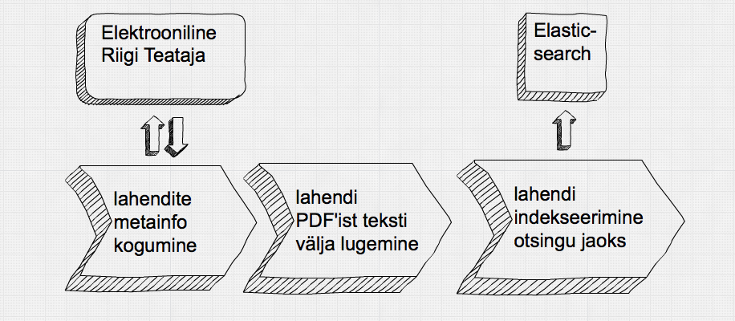
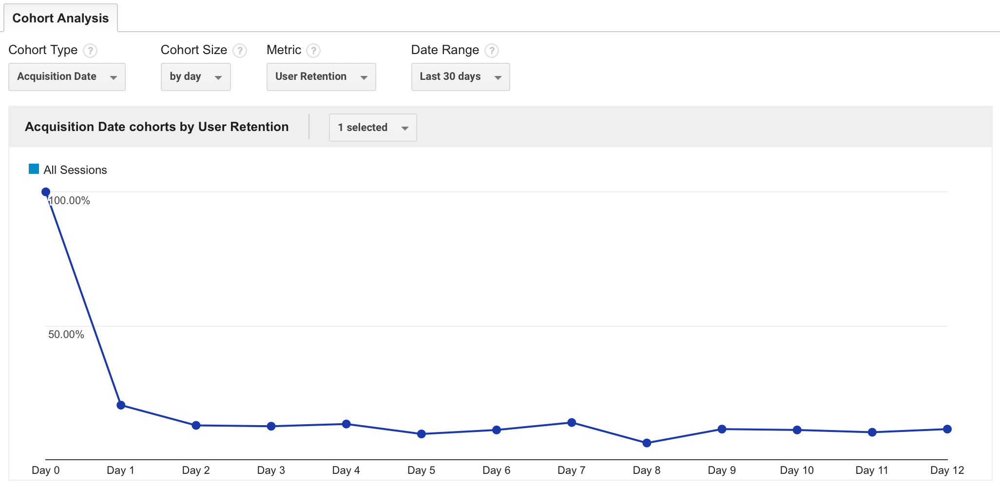

# Ülevaade legal.ee projektist
### Sissejuhatus
[Legal.ee](http://legal.ee) on kasutajasõbralik maa- ja ringkonnakohtu lahendit otsing. Selles dokumendis on kirjutatud lahti, miks ja kuidas see rakendus on loodud. Käsitletakse järgmiseid teemasid:

1) Motivatsioon legal.ee otsingu loomiseks;

2) Ülevaade legal.ee otsingust;

3) Legal.ee ja ERT otsingute võrdlus;

4) Legal.ee kasutatavus Google Analytics'i andmete põhjal.

Dokumendis on kasutusel järgmised lühendid:

ERT – [Elektrooniline Riigi Teataja](https://www.riigiteataja.ee/)

ERT otsing – [ERT Maa- ja Ringkonna kohtute lahendite otsing](https://www.riigiteataja.ee/kohtuteave/maa_ringkonna_kohtulahendid/main.html)

### Motivatsioon legal.ee otsingu loomiseks

Kui töötasin juristina, siis panin tähele, et [ERT otsingu](https://www.riigiteataja.ee/kohtuteave/maa_ringkonna_kohtulahendid/main.html) täisteksti otsingut kasutades oli keeruline leida kohtulahendeid. [ERT otsingu](https://www.riigiteataja.ee/kohtuteave/maa_ringkonna_kohtulahendid/main.html) peamised puudused on järgmised:

1) Täisteksti otsing on vaikimisi fraasiotsing. See tähendab, et otsing *hanketeade hankedokumendid* tagastab kõik kohtulahendid, milles sõnast *hankedokumendid* järgmine sõna on *hanketeade*. Kõigi populaarsemate otsingumootorite jaoks on mitut sõna sisaldavad otsingud vaikimisi konjuktiivsed. See tähendab, et otsingule *hanketeade hankedokumendid* vastavad kõik dokumendid, milles sisalduvad sõnad *hanketeade* JA *hankedokumendid*, olenemata nende sõnade paiknemisest kohtulahendis. [ERT otsingut](https://www.riigiteataja.ee/kohtuteave/maa_ringkonna_kohtulahendid/main.html) on võimalik teha mitmest sõnast koosnevat konjuktiivset otsingut kasutades sõnade vahel operaatorit *„&“* (näiteks *hanketeade „&“ hankedokumendid*). Samas on selline süntaks väga ebaintuitiivne ning ma ei ole veel kohanud ühtegi juristi, kes oleks teadnud, et just sellist kirjapilti tuleb kasutada konjuktiivse otsingu teostamiseks.

2) Isegi kui kasutada otsingut õigesti, ei tagasta see kõiki kohtulahendeid, mis vastavad otsingu filtritele. Mõningatel puhkudel tagastab otsing hulgaliselt kohtulahendeid, mis ei vasta otsingu kriteeriumitele. Sellest kirjutan lähemalt alapealkirja „Legal.ee ja ERT otsingute võrdlus“ all.

3) Otsida saab vaid sõna täpseid vasteid, mis jätab otsingutulemuste hulgast välja kohtulahendid, milles on kasutatud sama sõna mõnes muus käändes. [Legal.ee](http://legal.ee) lahendustest sellele probleemile kirjutan alapealkirja „Mittetäpsed sõnaotsingud“ all.

### Ülevaade legal.ee otsingust

[Legal.ee](http://legal.ee) loomiseks kogusin kokku kõigi [ERT's](https://www.riigiteataja.ee/) sisalduvate Maa- ja Ringkonnakohtu lahendite metaandmed ning täistekstid ning indekseerisin need otsingus kasutamiseks sobivale kujule. Kohtulahendite kogumise ja indekseerimise teostasin järgmist skeemi järgides.

1) Kogusin enam kui 400 000 lahendi metainfo (PDF'i URL, lahendi nr, kuupäev jne).

2) Laadisin alla kohtulahendeid sisaldavad PDF'id ning kasutades [Apache PDFBox teeki](https://pdfbox.apache.org/) lugesin igast PDF'ist välja selle sisu tekstina.

3) Lõpuks salvestasin kohtulahendi info (tekst, metaandmed) [Elasticsearch'i andmebaasi](https://en.wikipedia.org/wiki/Elasticsearch). Dokumendi salvestamise hetkel see indekseeritakse [pööratud indeksisse](https://en.wikipedia.org/wiki/Inverted_index).

[Legal.ee](http://legal.ee) kasutajaliides on [Django raamistikus](https://www.djangoproject.com/) kirjutatud veebirakendus, mis liidestub [Elasticsearchi andmebaasiga](https://en.wikipedia.org/wiki/Elasticsearch).

### Legal.ee ja ERT otsingute võrdlus

Hoolimata sellest, et vaid umbes 390 000 kohtulahendit ERT 414 000 kohtulahendist on otsitavad [legal.ee](http://legal.ee) kaudu (peamised põhjused, miks kohtulahendeid ei ole olnud võimalik teha otsitavaks, on 1) probleemid PDF'i tekstiks konverteerimisega 2) kohtulahendi PDF ei ole olnud kättesaadav), on [legal.ee](http://legal.ee) otsingud tõhusamad ja täpsemad kui samasisulised otsingud [ERT's](https://www.riigiteataja.ee/). Seda tõestab eksperiment, milles tegin samu päringuid mõlema otsingumootoriga.

[Legal.ee](http://legal.ee) kasutajate poolt tehtud päringute põhjal võin öelda, et peaaegu kõik otsingud kuuluvad mõnda järgmistest kategooriatest:

1) üldmõiste

2) isiku nimi

3) kohtulahendi number

4) seaduse säte

Kuna erinevat laadi otsingud võivad anda erinevad tulemused, siis olen ülevaatlikkuse huvides grupeerinud testpäringud kategooriate kaupa. Testpäringuteks olen valinud kesksed terminid viiest viimati avaldatud Riigikohtu lahendist ([3-3-1-43-15](http://www.riigikohus.ee/?id=11&tekst=RK/3-3-1-43-15), [3-3-1-44-15](http://www.riigikohus.ee/?id=11&tekst=RK/3-3-1-44-15), [3-3-1-29-15](http://www.riigikohus.ee/?id=11&tekst=RK/3-3-1-29-15), [3-4-1-24-15](http://www.riigikohus.ee/?id=11&tekst=RK/3-4-1-29-15), [3-1-1-62-15](http://www.riigikohus.ee/?id=11&tekst=RK/3-1-1-29-15)).

##### Otsingud üldmõiste kohta
<table>
    <tr>
        <th align="left">ERT otsingu sisu</th><th align="left">Legal.ee otsingu sisu</th><th align="left">ERT vastete arv</th><th align="left">Legal.ee vastete arv</th>
    </tr>
    <tr>
        <td>hankedokumendid</td><td>hankedokumendid</td><td>125</td><td>142</td>
    </tr>
    <tr>
        <td>Lasteaedade „&“ liitmine</td><td>Lasteaedade liitmine</td><td>0</td><td>2</td>
    </tr>    
    <tr>
        <td>Õppimine „&“ vanglas</td><td>Õppimine vanglas</td><td>3</td><td>179</td>
    </tr>
    <tr>
        <td>Kriminaalmenetluses „&“ tehtud „&“ kohtuotsuse „&“ vaidlustamine</td><td>kriminaalmenetluses tehtud kohtuotsuse vaidlustamine</td><td>0</td><td>52</td>
    </tr>
    <tr>
        <td>Heauskne „&“ omandamine</td><td>Heauskne omandamine</td><td>96</td><td>143</td>
    </tr>
</table>
##### Otsingud isiku nime kohta
<table>
    <tr>
        <th align="left">ERT otsingu sisu</th><th align="left">Legal.ee otsingu sisu</th><th align="left">ERT vastete arv</th><th align="left">Legal.ee vastete arv</th>
    </tr>
    <tr>
        <td>AS Eesti Keskkonnateenused</td><td>„AS Eesti Keskkonnateenused“</td><td>15</td><td>18</td>
    </tr>
    <tr>
        <td>Narva Linnavolikogu</td><td>„Narva Linnavolikogu“</td><td>122</td><td>125</td>
    </tr>    
    <tr>
        <td>Viru Vangla</td><td>„Viru Vangla“</td><td>14288</td><td>15591</td>
    </tr>
    <tr>
        <td>Raivo Paala</td><td>„Raivo Paala“</td><td>64</td><td>69</td>
    </tr>
    <tr>
        <td>Algis Sepp</td><td>„Algis Sepp“</td><td>402</td><td>417</td>
    </tr>
</table>
##### Otsingud kohtulahendi numbri järgi
<table>
    <tr>
        <th align="left width=25%">ERT otsingu sisu</th><th align="left">Legal.ee otsingu sisu</th><th align="left">ERT vastete arv</th><th align="left">Legal.ee vastete arv</th>
    </tr>
    <tr>
        <td>3-4-1-34-14</td><td>„3-4-1-34-14“</td><td>49</td><td>2</td>
    </tr>
    <tr>
        <td>3-3-1-44-09</td><td>„3-3-1-44-09“</td><td>90</td><td>36</td>
    </tr>
    <tr>
        <td>3-12-2452</td><td>„3-12-2452“</td><td>2</td><td>0</td>
    </tr>    
    <tr>
        <td>1-07-2186</td><td>„1-07-2186“</td><td>18</td><td>20</td>
    </tr>
    <tr>
        <td>3-1-1-21-13</td><td>„3-1-1-21-13“</td><td>138</td><td>0</td>
    </tr>
</table>
##### Otsingud seaduse sätte järgi
<table>
    <tr>
        <th align="left">ERT otsingu sisu</th><th align="left">Legal.ee otsingu sisu</th><th align="left">ERT vastete arv</th><th align="left">Legal.ee vastete arv</th>
    </tr>
    <tr>
        <td>RHS § 122 lg 3 p 5</td><td>„RHS § 122 lg 3 p 5“</td><td>42</td><td>5</td>
    </tr>
    <tr>
        <td>HKMS § 249 lg 1 </td><td>„HKMS § 249 lg 1“</td><td>267</td><td>193</td>
    </tr>
    <tr>
        <td>VangS § 84 lg 1</td><td>„VangS § 84 lg 1“</td><td>0</td><td>0</td>
    </tr>    
    <tr>
        <td>KarS § 386 lg 1</td><td>„KarS § 386 lg 1"</td><td>252</td><td>226</td>
    </tr>
    <tr>
        <td>KrMS § 470 lg 1</td><td>„KrMS § 470 lg 1“</td><td>10</td><td>3</td>
    </tr>
</table>

**Otsingud üldmõiste kohta** näitavad, et ilmselt ei tule [ERT otsing](https://www.riigiteataja.ee/kohtuteave/maa_ringkonna_kohtulahendid/main.html) kuigi hästi toime konjuktiivsete otsingukriteeriumitega. Ühest sõnast koosnev otsing hankedokumendid annab samas suurusjärgus vastuseid nagu [legal.ee](http://legal.ee) otsing. Samas ülejäänud nelja otsingu puhul töötab [legal.ee](http://legal.ee) otsing oluliselt paremini kui [ERT otsing](https://www.riigiteataja.ee/kohtuteave/maa_ringkonna_kohtulahendid/main.html).

**Otsingud isiku nime kohta** on kategooria, milles erinevus [ERT](https://www.riigiteataja.ee/kohtuteave/maa_ringkonna_kohtulahendid/main.html) ja [legal.ee](http://legal.ee) otsingute vahel on kõige väiksem. Paistab, et [ERT otsing](https://www.riigiteataja.ee/kohtuteave/maa_ringkonna_kohtulahendid/main.html) võimaldab üsna edukalt otsida kohtulahendit selles sisalduva fraasi järgi.

**Otsingud kohtulahendi numbri ja seaduse sätte järgi** tagastasid [ERT otsingut](https://www.riigiteataja.ee/kohtuteave/maa_ringkonna_kohtulahendid/main.html) kasutades rohkem tulemusi kui [legal.ee'd](http://legal.ee) kasutades, kuid tulemuste kontroll näitas, et tagastatud kohtulahendite hulgas oli palju selliseid, milles puudus viide otsitavale kohtulahendile või seaduse sättele.

### Mittetäpsed sõnaotsingud

Eesti keeles on 14 käänet, mis tähendab, et sama tüvega sõna on võimalik kirjutada mitmel erineval viisil. Otsingumootori kasutajal on sageli vaja leida dokumendid, milles sisaldub sõna, mis võib olla erinevates käänetes. Näiteks kui otsingu kasutajat huvitavad kohtulahendid, milles sisaldub sõna hankedokumendid, siis on tõenäoline, et teda huvitavad ka kohtulahendid, kus on olemas üks järgmistest sõnadest hankedokument, hankedokumendi, hankedokumente jne.

[Legal.ee](http://legal.ee) võimaldab määrata ära mustri, millele otsitav sõna peab vastama, kasutades selleks märki <b>*</b> (0-n suvalist tähemärki) või **?** (1 suvaline tähemärk). Näiteks otsingule <i>hankedokumen*</i> vastavad kõik kohtulahendid, milles sisaldab sõna, mis algab tähtedega *hankedokumen*. Päringule *hankedokumen??* vastavad kohtulahendid, milles sisaldub sõna, milles on 14 tähemärki ja mille 12 esimest tähemärki on *hankedokumen*. Vastavad kohtulahendid, mis sisaldavad sõnu *hankedokumenti*, *hankedokumendi*, *hankedokumente*, kuid mitte kohtulahendid, mis sisaldavad sõnu *hankedokument* (13 tähemärki) ja hankedokumentide (15 tähemärki).

Samuti on [legal.ee](http://legal.ee) otsingus võimalik kasutada operaatorit **OR**. Näiteks kui on vaja leida kohtulahendid, milles sisaldub sõna hankedokument ainsuse või mitmuse nimetavas käändes, saab selleks kasutada päringut *hankedokument OR hankedokumendid*.

### Legal.ee kasutatavus Google Analytics'i andmete põhjal

[Legal.ee](http://legal.ee) kasutamise monitoorimiseks olen kasutanud [Google Analytics'it](http://www.google.com/analytics/). Allolevalt graafikult on näha, et [legal.ee'd](http://legal.ee) kasutavate inimeste arv on võrdlemisi sarnasel tasemel olnud sellest ajast peale, kui hakkasin kasutama [Google Analytics'it](http://www.google.com/analytics/) [legal.ee](http://legal.ee) kohta statistika kogumiseks.

Järgmisel graafikul on näha, et järgmisel päeval pärast [legal.ee](http://legal.ee) esmakordset kasutamist kasutab [legal.ee'd](http://legal.ee) 20% kasutajatest ning kõigil järgnevatel päevadel veidi enam kui 10% kasutajatest. Rõõmustav on see, et alates 2. päevast [legal.ee](http://legal.ee) kasutatavus stabiliseerub. Tähendab, et kasutajatest, kes kaks päeva pärast [legal.ee](http://legal.ee) esmakasutamist otsustavad seda uuesti kasutada, saavad [legal.ee](http://legal.ee) püsikasutajad. 

